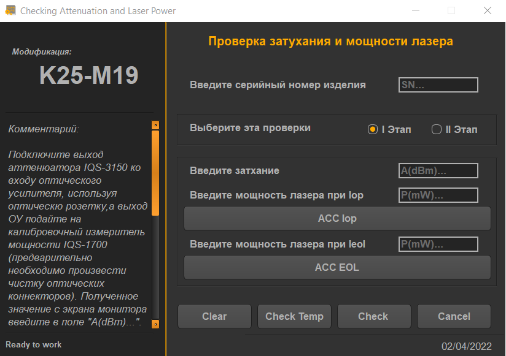

# **GUI for workflow automation**

The program allows to automate the workflow. There is automatic connection to the ZOC Terminal. There is a modern design in the UI.

## Libraries

 - PyQt5
 - pywinauto

## Screenshots
Screenshots of the main and modal windows:

